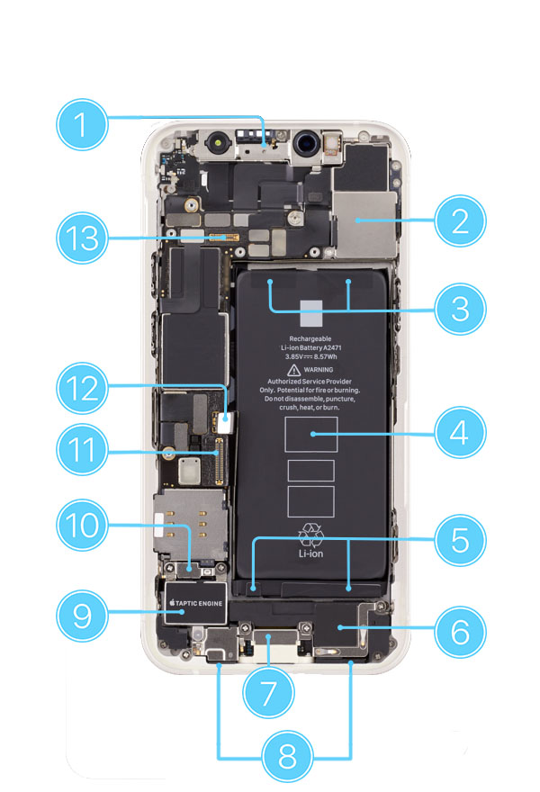
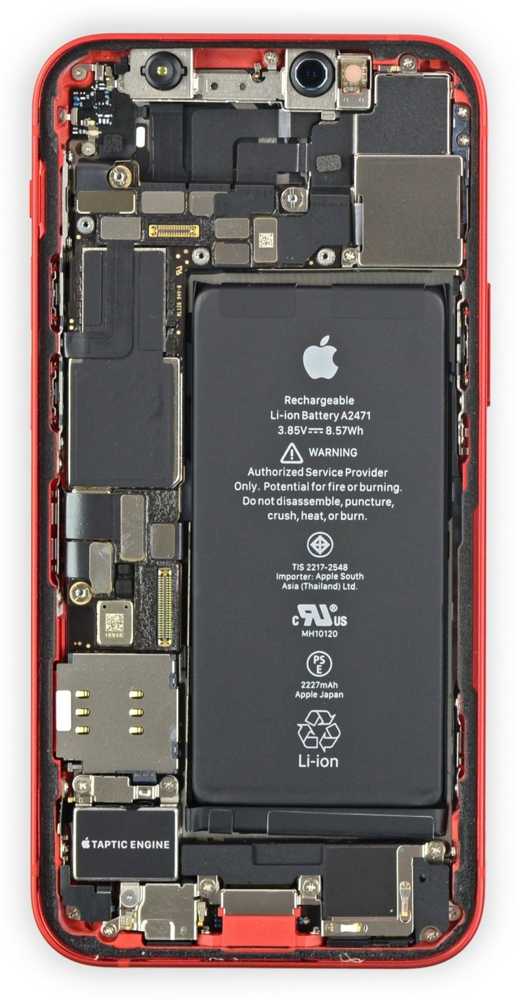
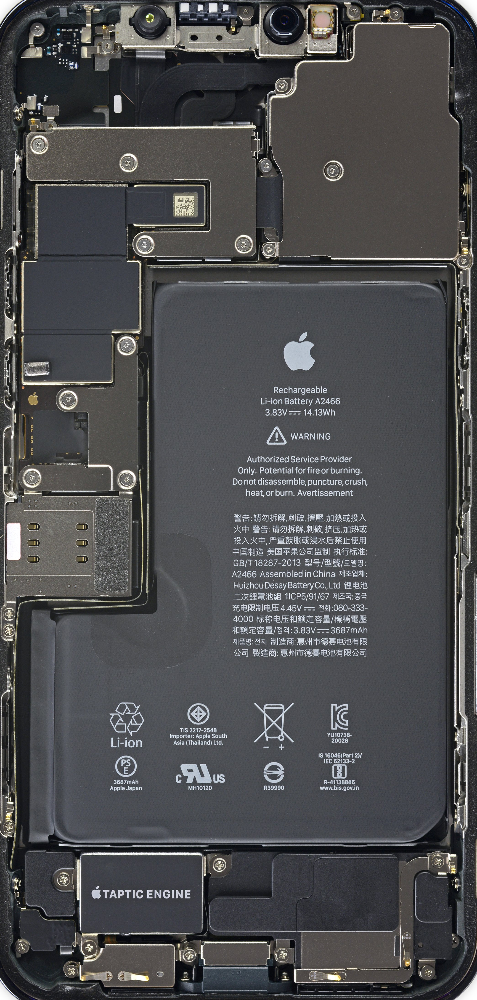

# ABSTRACT

The iPhone 12 mini is the best form factor I've experienced in a phone: to the point that, at the failure of my lightning port (likely to roatan seawater, long-delayed) and 2 years of using a samsung z flip 5, I still miss the 12 mini. Well, first I had only planned to open it up to replace the battery and the port, leaving it otherwise unmodified. But I have otherwise long moved on from lightning, and am not eager to carry around an additional cord that will almost certainly be necessary to account for the battery (or lack thereof) of the 12 mini. Well, here's my summer attempt at taking my pcb design skills beyond the familiarity of through-hole components and the basic routing of keyboards. 

## MAIN CHALLENGES

- The 12 mini is *compact*. This is impressive, but makes repair, let along the addition of new components, perilous. My hope is that I won't have to take advantage of replacing of the battery to orient the replacement slightly higher, allowing me to make use of the (important and safety relevant) battery expansion area currently at the top (see **3** from the apple repair guide) and slot necessary circuitry in the currently occupied space by **5**. This is a *last resort*.

*iPhone 12 mini internals from Apple repair guide*

- C94 boards (used for the conversion from USB C to lightning's USB 2.0 standard and to certify/communicate useful stuff like PD) are not exactly open-source. My best bet is to grab some board + connectors from alibaba, as opposed to the messy and low yield approach of tearing apart MFI charging cords. Then I'll have to de-solder the attached MCUs and replicate the traces in the flex PCB. Unfortunately this means I'll need to invest in a hot air gun or a small hotplate.

### media links

*look how much more space we'd have above the lightning port if we did this with the iPhone 12 and not the mini...*